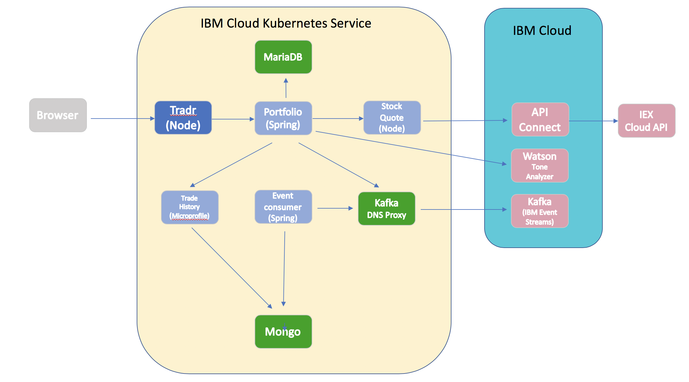

# Stock Trader Lite V2.0 on Kubernetes

The *IBM Stock Trader Lite V2.0*  application is a polyglot stock trading sample, where you can create various stock portfolios and add shares of stock to each for a commission. It keeps track of each portfolio’s total value and its loyalty level, which affect the commission charged per transaction. It also lets you submit feedback on the application, which can result in earning free (zero commission) trades, based on the tone of the feedback. (Tone is determined by calling the Watson Tone Analyzer).

The architecture of the  app is shown below:

* **Tradr** is a Node.js Express  UI for the portfolio service that implements the Backend for Frontend (BFF) pattern.

* The **stock-quote** is a Open Liberty service that queries an external service to get real time stock quotes via an API Connect proxy.

* The **portfolio** microservice is a Spring Boot application that  sits at the center of the Stcok Trader V2.0 app. This microservice:

   * persists trade data  using JDBC to a MariaDB database
   * invokes the **stock-quote** service to get stock quotes
   * sends completed transactions to a local DNS proxy to IBM Event Streams running in the IBM Cloud.
   * calls the **trade-history** service to get aggregated historical trade data.

* The **event-consumer** microservice is a POJO application that receives the transaction data from  Event Streams and calls the  **trade-history** service to publish the data to the reporting database.

* The **trade-history** microservice is a Python Flask application the manages historical trading data in a PostgreSQL database.
